# Machine Learning Language Models for Chemical Generation

### Note: project under active development. This README is out of date almost immediately upon writing. 

This repository contains code and notebooks for training and using machine learning language models to generate chemical structures, specifically SMILES strings. The models are designed to learn the syntax and semantics of chemical representations, enabling the generation of novel molecules.

Most language modelling tools are aimed at natural language processing, but the chemical language of SMILES strings is a rich and complex language in its own right, with syntax, grammar and vocabulary all of its own. This repository provides tools for training and using models to generate SMILES strings, which can be used to explore the chemical space and generate novel molecules.

This readme is derived from the results of "notebooks/ind_rnn_generator.ipynb" run that notebook for an interactive experience!

# Application Example, Generating Novel Antibiotics and cardiovascular drugs

### We train the model on the ChEMBl dataset of drug molecules. Considering drugs in stage 4 or 5 of clinical development, for the 50 most common indications. 

The CharSMILESChEMBLIndications dataset contains smiles strings associated with their drug indications (i.e. what diseases or conditions they are able to treat)


```python

dataset = datasets.CharSMILESChEMBLIndications(
    batch_size=128
)
```

## What are some of the most common indications in our dataset


```python
most_frequent_indications = dataset.all_data.drop(columns=["canonical_smiles"]).sum(axis=0).sort_values(ascending=False)
most_frequent_indications_names = most_frequent_indications.index.to_list()
fig, ax = plt.subplots(ncols=1, nrows=1, figsize=(20, 5))
ax.bar(np.arange(len(most_frequent_indications)), most_frequent_indications.to_numpy())
ax.set_xticks(np.arange(len(most_frequent_indications)))
labels = ax.set_xticklabels([heading.replace("mesh_heading_", "") for heading in most_frequent_indications.index], rotation=90)
ax.set_yscale("log")
```


    
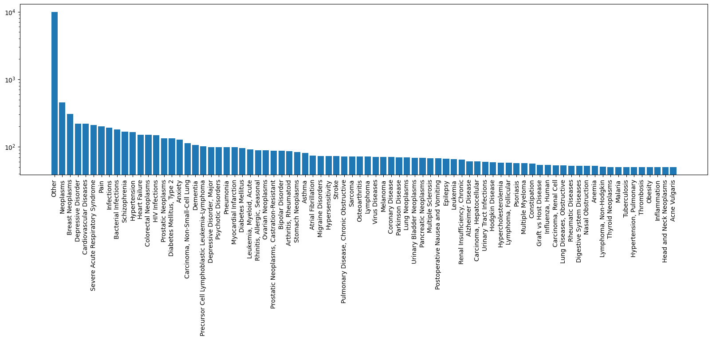
    


## What do the molecules look like for our most common indication?


```python
images_per_indication = 9  # Visualise a 3x3 grid of drug molecules

for indications_filter_index in range(10):
    # indications_filter_index = 1
    indications_filter_name = most_frequent_indications.index[indications_filter_index]
    filtered_molecules = dataset.all_data.filter(items=["canonical_smiles", indications_filter_name])
    filtered_molecules = filtered_molecules[filtered_molecules[indications_filter_name]].drop(columns=[indications_filter_name])
    filtered_molecules = filtered_molecules.rename(columns={"canonical_smiles": indications_filter_name})

    smiles_to_draw = [smiles for smiles in filtered_molecules[indications_filter_name][:images_per_indication]]

    display(Markdown(f"## Showing {images_per_indication} example chemical structures for {indications_filter_name}"))
    display(
        utilities.draw_molecules_as_grid_from_smiles(
            canonical_smiles=smiles_to_draw, 
            names=[str(i + 1) for i in range(images_per_indication)]  # Just number them
        )
    )
```

## Showing 9 example chemical structures for mesh_heading_Neoplasms
### Note: Neoplasms refers to cancer
    
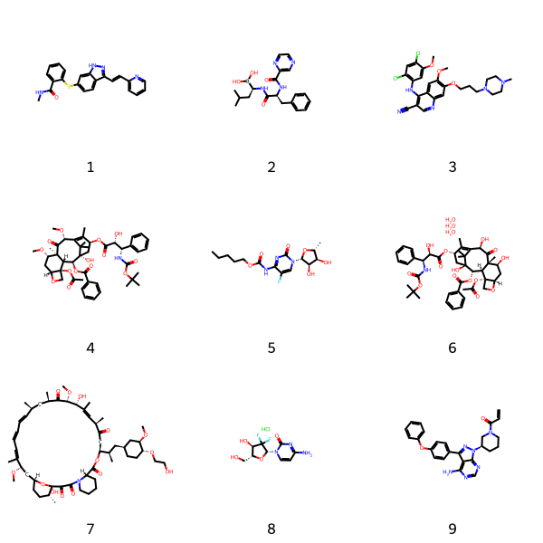
    

## Showing 9 example chemical structures for mesh_heading_Breast Neoplasms
### Note: Neoplasms refers to cancer    

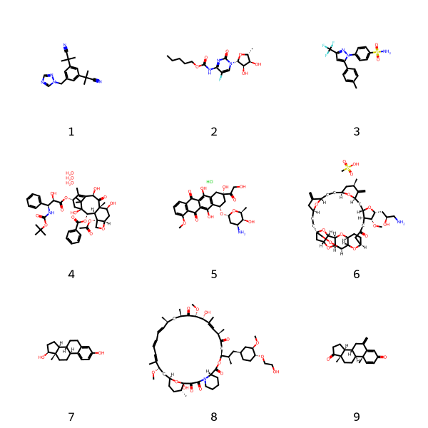
    

## Showing 9 example chemical structures for mesh_heading_Cardiovascular Diseases
    
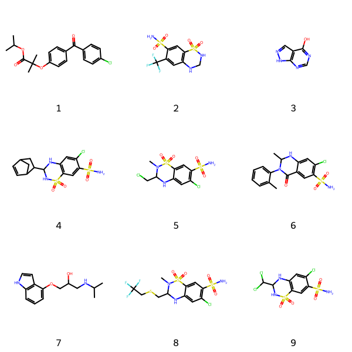
    

## Showing 9 example chemical structures for mesh_heading_Severe Acute Respiratory Syndrome

    
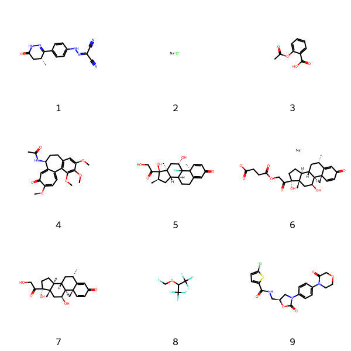

## Showing 9 example chemical structures for mesh_heading_Pain
    
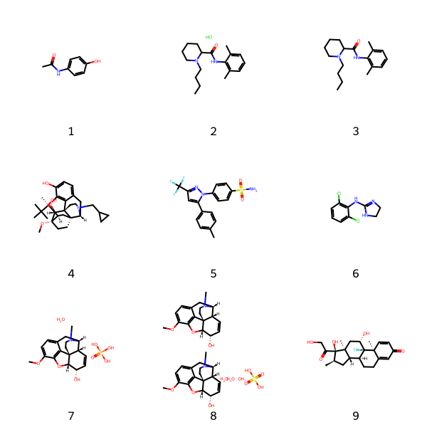

## Showing 9 example chemical structures for mesh_heading_Infections


    rows=3, cols=3

# Model training


```python
config = ind_generator.SmilesIndGeneratorRNNConfig(
    vocab_size = len(dataset.vocab),
    num_indications = dataset.num_indications,
    num_hiddens = 256,
    num_layers = 4,
    learning_rate = 1e-3,
    weight_decay = 1e-5,
    output_dropout = 0.4,
    rnn_dropout = 0.4,
    state_dropout = 0.4
)


model = ind_generator.SmilesIndGeneratorRNN(config)
model_trainer = trainer.Trainer(max_epochs=64, init_random=None, clip_grads_norm=10.0)
model_trainer.fit(model, dataset)

```

    Epoch 1 completed in 21.68 seconds
    Epoch 1/64: Train Loss: 0.8586, Val Loss: 0.8678
    Epoch 2 completed in 21.39 seconds
    Epoch 2/64: Train Loss: 0.4788, Val Loss: 0.7793
    Epoch 3 completed in 20.71 seconds
    Epoch 3/64: Train Loss: 0.3873, Val Loss: 0.5368
    Epoch 4 completed in 20.81 seconds
    [...]
    Epoch 62 completed in 21.14 seconds
    Epoch 62/64: Train Loss: 0.0663, Val Loss: 0.1260
    Epoch 63 completed in 21.11 seconds
    Epoch 63/64: Train Loss: 0.0662, Val Loss: 0.1249
    Epoch 64 completed in 20.98 seconds
    Epoch 64/64: Train Loss: 0.0656, Val Loss: 0.1277
    Saving model to ../models/Chembl-Ind-SmilesIndGeneratorRNN-CharSMILESChEMBLIndications-2025-08-07-10-45-53.pt


```python
if train_new:
    losses = utilities.extract_training_losses(model_trainer.metadata)
    fig, ax = plots.plot_training_validation_loss(
        training_losses = losses['avg_train_losses'], 
        validation_losses = losses['avg_val_losses']
    )
    ax.set_yscale('log')
```
    
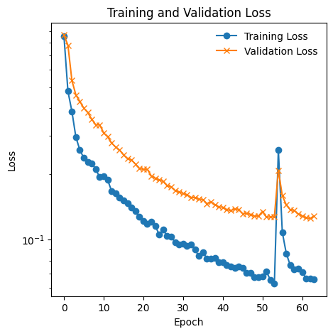
   
   
# Example usage: generating molecules for a particular indication

## Example 1: Generating antibiotics (mesh heading: Infections, or Bacterial Infections)

### We generate an array of molecules which bear similarity to macrocyline, anthracycline and beta-lactam derived antibiotics.


```python
# indication = "mesh_heading_Infections"
indication = "mesh_heading_Bacterial Infections"
indication_name = indication.replace("mesh_heading_", "")
outputs = generate_samples(
    rows=5,
    cols=5,
    dataset=dataset,
    model=model,
    prompt=dataset.vocab.bos.char, # Prompt is just the beginning of sentence special character, expect a diverse range of molecules
    indication_name=indication,
    max_attempts=10,
    max_generate=100,
    temperature=0.9
)

display(
    Markdown(f"## {indication_name}")
)
display(
    utilities.draw_molecules_as_grid_from_smiles(
        canonical_smiles=outputs, 
        names=[indication_name] * len(outputs)  
    )
)
```

## Bacterial Infections

    
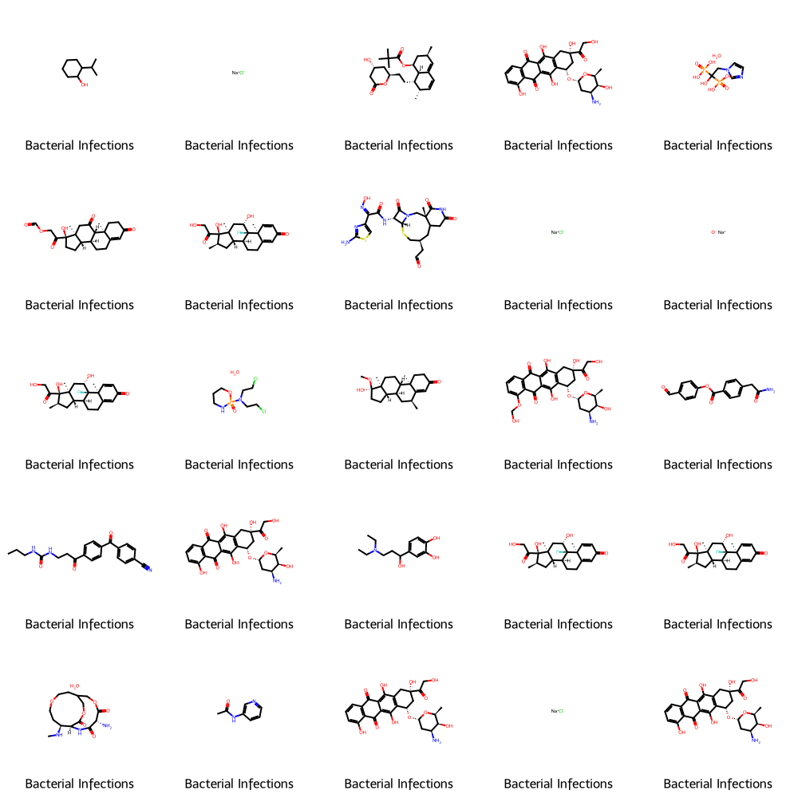    


## Example 2: if we'd like to generate drugs for treating cardiovascular diseases derived from sulfamethoxazole, we can supply a fragment of sulfamethoxazole as a prompt.


```python
# Specify mesh heading
indication = "mesh_heading_Cardiovascular Diseases"


indication_name = indication.replace("mesh_heading_", "")
outputs = generate_samples(
    rows=5,
    cols=5,
    dataset=dataset,
    model=model,
    prompt="<CC1=CC(=NO1)NS(=O)(=O)C",  # Special prompt defines the subtype of molecules we'd like to see
    indication_name=indication,
    max_attempts=10,
    max_generate=100,
    temperature=0.7,
)

display(
    Markdown(f"## {indication_name}")
)
display(
    utilities.draw_molecules_as_grid_from_smiles(
        canonical_smiles=outputs, 
        names=[indication_name] * len(outputs)  
    )
)
```

## Cardiovascular Diseases

    
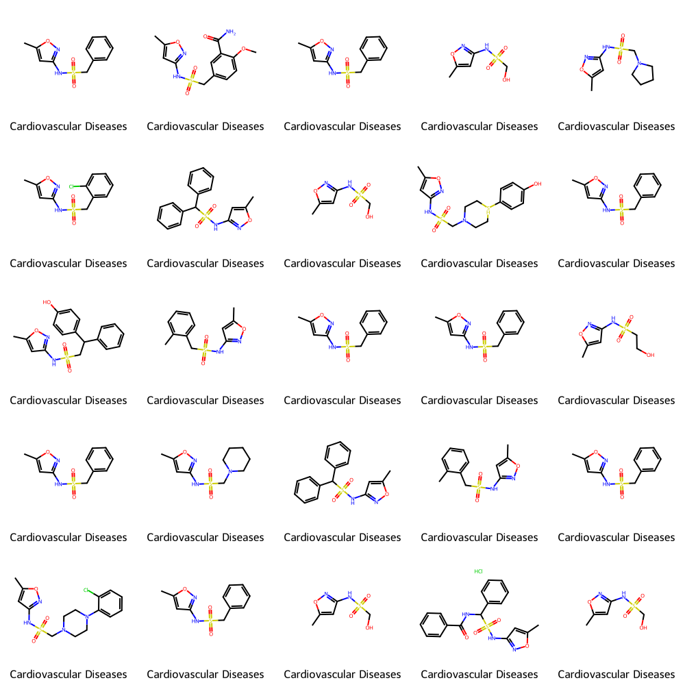
    

## Increasing the temperature lets us control the diversity of the molecules generated.


```python
# Specify mesh heading
indication = "mesh_heading_Cardiovascular Diseases"


indication_name = indication.replace("mesh_heading_", "")
outputs = generate_samples(
    rows=5,
    cols=5,
    dataset=dataset,
    model=model,
    prompt="<CC1=CC(=NO1)NS(=O)(=O)C",
    indication_name=indication,
    max_attempts=10,
    max_generate=100,

    # Increased temperature, more diversity within subtype.
    temperature=1.3,  
)

display(
    Markdown(f"## {indication_name}")
)
display(
    utilities.draw_molecules_as_grid_from_smiles(
        canonical_smiles=outputs, 
        names=[indication_name] * len(outputs)  
    )
)
```

## Cardiovascular Diseases

    
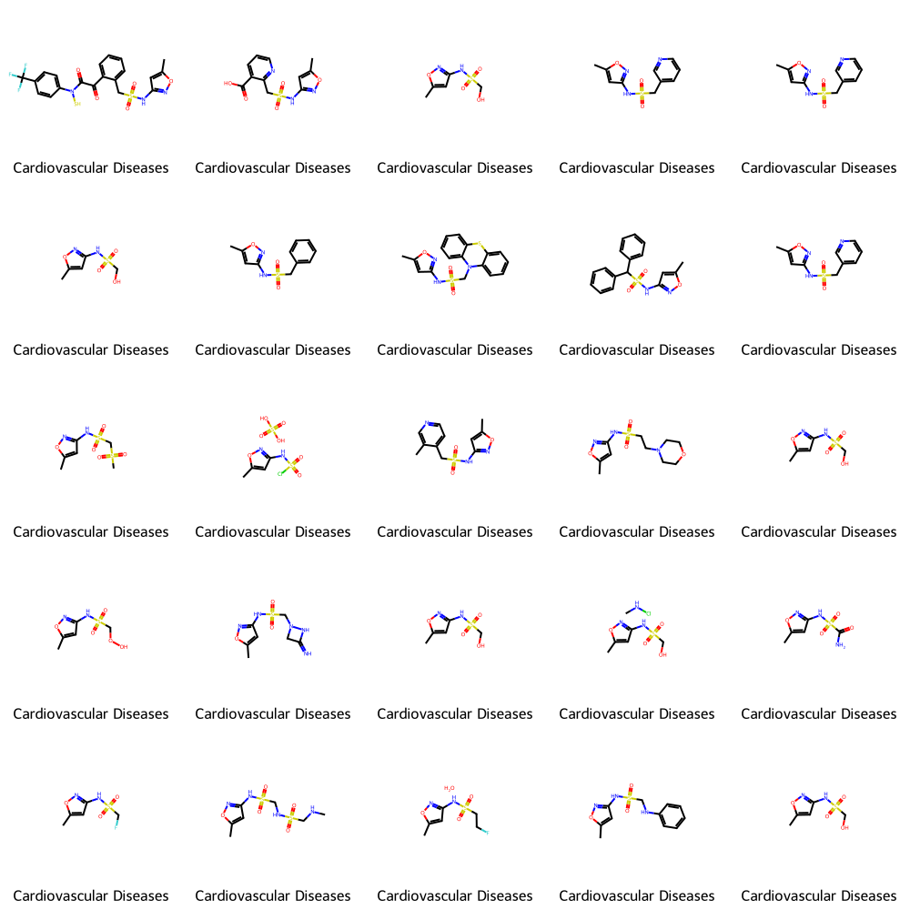
    

```python
# # Some Fun outputs from playing with these models.

# Crazy triple macrocycle antibiotic
#  'N[C@H](CC(C)C)C(=O)N[C@H]1C(=O)N[C@@H](CC(N)=O)C(=O)N[C@H]2C(=O)N[C@H]3C(=O)N[C@H](C(=O)N[C@H](C(=O)O)c4cc(O)cc(O)c4-c4cc3ccc4O)[C@H](O)c3ccc(c(Cl)c3)Oc3cc2cc(c3O[C@@H]2O[C@H](CO)[C@@H](O)[C@H](O)[C@H]2O[C@H]2C[C@](C)(N)[C@H](O)[C@H](C)O2)Oc2ccc(cc2Cl)[C@H]1O',

# Polypeptide macrocycle, containing cysteine disulfide bridge, antibiotic
# 'C(C)[C@@H]1NC(=O)[C@H](CCCCN)NC(=O)[C@@H](Cc2c[nH]c3ccccc23)NC(=O)[C@H](Cc2ccccc2)NC(=O)[C@@H](NC(=O)[C@H](N)Cc2ccccc2)CSSC[C@@H](C(=O)N[C@H](CO)[C@@H](C)O)NC1=O',

```

## We can visualise our molecules in 3D for closer inspection.


```python
view = utilities.visualise_3d_molecule_from_smiles(outputs[3])
view
```

# Development thoughts

For such a simple model, the results of this test are rather impressive. The model has learned to generate valid SMILES strings, which correspond to real molecules. In order to do this, the model will have implicitly "learned" the correct valences for atoms, common functional groups, and the rules of SMILES syntax, which is not a trivial task.

We can see that the model has learned to generate a variety of different molecules, some of which are quite complex. The model is able to generate molecules with rings, branches, and various functional groups, all while adhering to the rules of SMILES syntax. Occasionally included are rarer functional groups which are common in some pharmaceuticals, such as trifluoromethyl groups (CF3).

Of course, because SMILES strings are syntactially rigid, often with long-range dependencies, a simple model like this smaller LSTM will sometimes generate molecules which are _almost_ but not quite valid. Models become better at avoiding these syntactic errors with longer training and larger models. 

Above, we can see that the model has learned to generate valid SMILES strings, but we can also see information on the types of errors the model makes. These fall into two categories, syntactic errors, where the model generates a string which is not valid SMILES, and semantic errors, where the model generates a valid SMILES string but one which does not correspond to a real molecule. 

Syntactic: e.g. The model has a tendancy to open parentheses but not close them, or opening rings but not specifying where they close:

`SMILES Parse Error: extra open parentheses while parsing: CC(=O)N[C@@H](CCCCN)C(=O)N[C@@H](CCCCN)C(=O)N[C@@H](CCCN=C(N)N)C(=O)N[C@@H](CC(C)C)C(=O)N[C@@H](CCCC
SMILES Parse Error: check for mistakes around position 96:
(CC(C)C)C(=O)N[C@@H](CCCC
`

Semantic: E.g. Occasionally generating molecules where atoms have incorrect valences (e.g. F with two bonds):

`SMILES Parse Error: Failed parsing SMILES ' HC(=O)N[C@H](C(=O)N[C@@H](CCCCN)C(=O)N[C@@H](CCCCN)C(=O)N[C@@H](CCCCN)C(=O)N[C@@H](Cc1ccc(O)cc1)C(=O''
Explicit valence for atom # 0 F, 2, is greater than permitted` 

The model also appears to have a real desire to generate long, saturated hydrocarbon chains. The training data does include some of these, so it's not surprising that the model has learned to generate them. If in doubt, the next character is probably just a saturated carbon atom.


# Legacy Examples.

## Application Example: Generating Caffeine-Like molecules with an LSTM.

**Note, out of date. Correct way to do this now is to condition initial hidden state of model to produce molecules with desired properties.**

We could say that we hope to generate _variants_ of an existing molecule, but with random, physically plausible changes to the structure.

Lets take caffiene, every scientists favourite, without it no work would get done. It is described by the following SMILES string `CN1C=NC2=C1C(=O)N(C(=O)N2C)C`.

We can generate a series of caffiene-like molecules by providing the model with a portion of the caffiene SMILES and asking it to predict the next character in the SMILES string.


```python

for i in range(20):
    output = simple_rnn.simple_generate("CN1C=NC2=C1C(=O)N", n_chars, model, chembl.char_to_idx, chembl.idx_to_char, temperature=0.8, device='cuda')
 
display(Markdown(f"# Generated {n_valid} valid caffiene-like molecules and {n_invalid} invalid SMILES strings out of 20 attempts."))
display(Markdown("## Generated Molecules"))
for img in images:
    display(img)
```


## Generated 10 valid caffeine-like molecules and 10 invalid SMILES strings out of 20 attempts.

Here is the structure of caffeiene for reference:

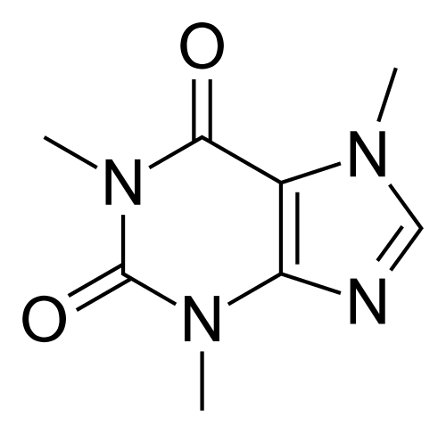

Below, we can see examples of some of the caffeine-like molecules generated with our model. The model has learned to generate molecules which are structurally similar to caffeine, but with variations in the side chains and functional groups. Some of these molecules are quite complex, with multiple rings and functional groups, while others are simpler. 

## Sample of Generated Molecules
   
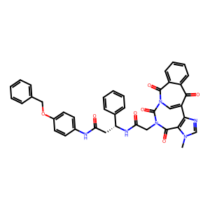
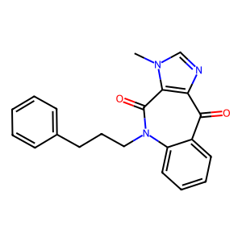
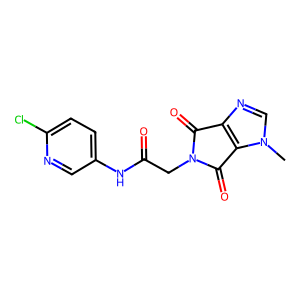
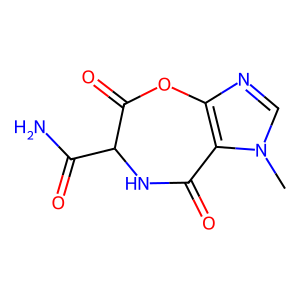
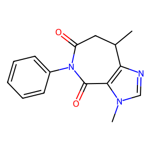
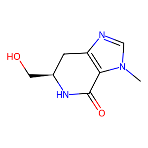   
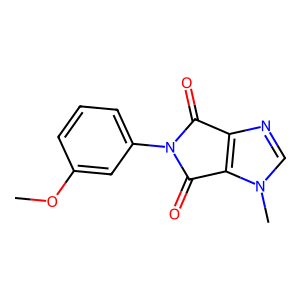