# Machine Learning Language Models for Chemical Generation

This repository contains code and notebooks for training and using machine learning language models to generate chemical structures, specifically SMILES strings. The models are designed to learn the syntax and semantics of chemical representations, enabling the generation of novel molecules.

## Example, generating Caffeine-Like molecules with an LSTM.


```python
import sys, os

sys.path.append("../")

import torch

from data import chembldb, datasets
from training import trainer
from modules import simple_rnn
import datetime
import plots, utilities
from IPython.display import Image, display, Markdown

import torch

```

## First we load the SMILES strings representing the molecules in the CHEMBL database.


```python
# the whole dataset is huge, so we only take every nth SMILES string
every_nth = 10
chembl_raw = chembldb.ChemblDBChemreps()
chembl_smiles = chembl_raw._load_or_download()["canonical_smiles"].to_list()[::every_nth]
```


```python
# Chembl smiles contains a list of all the SMILES strings in the Chembl database.
chembl_smiles[:10]
```


    ['Cc1cc(-c2csc(N=C(N)N)n2)cn1C',
     'COc1ccc2c(c1OC)C(CC1(C)C=Cc3c(c4cccc(OC)c4n(C)c3=O)O1)N(C)c1c-2ccc2cc3c(cc12)OCO3',
     'N=c1sc2ccccc2n1CCN1CCC(c2ccc(F)cc2)CC1',
     'COC(=O)C[C@H]1C(C)(C)[C@H](OC(C)=O)[C@H]2C(=O)[C@]1(C)[C@H]1CC[C@]3(C)[C@@H](CC(=O)O[C@H]3c3ccoc3)[C@]13O[C@H]23',
     'CN1C(=O)[C@H](NC(=O)Nc2cccc(OCCNC(=O)COCC(=O)NNC(=O)COCC(=O)N[C@H]3CC[C@@]4(O)[C@H]5Cc6cc(O)cc7c6[C@@]4(CCN5C)[C@H]3O7)c2)N=C(c2ccccc2)c2ccccc21',
     'CSCC[C@H](NC(=O)[C@@H](CC(C)C)NC(=O)CNC(=O)[C@H](Cc1ccccc1)NC(=O)[C@H](Cc1ccccc1)NC(=O)[C@@H](CCC(N)=O)NC(=O)[C@@H](CCC(N)=O)NC(=O)[C@@H]1CCCN1C(=O)[C@@H](CCCCN)NC(=O)[C@@H]1CCCN1C(=O)[C@@H](N)CCCN=C(N)N)C(N)=O',
     'CNC(=O)c1cc(C(O)CNC(C)CCc2ccc3c(c2)OCO3)ccc1O.Cl',
     'CC(=O)NC(C(=O)N1CCSCC1)[C@H]1CC(C(=O)O)C[C@@H]1N=C(N)N',
     'CC[C@H](C)[C@H](NC(=O)[C@H](CC(=O)O)NC(=O)[C@H](CC(C)C)NC(=O)[C@H](CC(C)C)NC(=O)[C@H](CCCCN)NC(=O)[C@H](CCCN=C(N)N)NC(=O)[C@H](CC(N)=O)NC(=O)[C@H](CO)NC(=O)[C@H](Cc1c[nH]cn1)NC(=O)[C@H](C)NC(=O)[C@H](CCC(N)=O)NC(=O)[C@H](CCC(N)=O)NC(=O)[C@H](C)NC(=O)[C@H](CC(C)C)NC(=O)[C@H](CCC(N)=O)NC(=O)[C@H](CC(=O)O)NC(=O)[C@H](C)NC(=O)[C@H](CCCCN)NC(=O)[C@@H](NC(=O)[C@H](CCSC)NC(=O)[C@H](CCC(=O)O)NC(=O)[C@H](CC(C)C)NC(=O)[C@@H](NC(=O)[C@H](CCC(=O)O)NC(=O)[C@H](CCCN=C(N)N)NC(=O)[C@H](CC(C)C)NC(=O)[C@H](CC(C)C)NC(=O)[C@H](Cc1c[nH]cn1)NC(=O)[C@H](Cc1ccccc1)NC(=O)[C@@H](NC(=O)[C@H](CC(C)C)NC(=O)[C@H](CC(=O)O)NC(=O)[C@H](C)NC(=O)[C@H](CO)NC(=O)[C@@H](NC(=O)[C@@H]1CCCN1C(=O)[C@@H]1CCCN1C(=O)[C@H](CCC(=O)O)NC(=O)[C@H](CCC(N)=O)NC(=O)[C@@H](N)CO)[C@@H](C)CC)[C@@H](C)O)C(C)C)[C@@H](C)O)C(=O)N[C@@H](C)C(N)=O',
     'CN(C)[C@H]1[C@@H](O[C@H]2O[C@H](CO)[C@@H](O)[C@H](N)[C@H]2O)[C@H](NC(=O)[C@@H](O)CCN)C[C@H](N)[C@H]1O[C@H]1O[C@H](CN)CC[C@H]1N']


```python
chembl = datasets.CharacterLevelSMILES(
    smiles_list = chembl_smiles,
    length = 256, 
    batch_size = 128
)
```

## Next, lets define a model. We'll be using a character-level LSTM model to predict the next character in a SMILES string based on the previous characters.


```python
model = simple_rnn.simpleLSTM(
    # Mandatory
    num_hiddens = 512,
    vocab_size = len(chembl.characters),
    # tuning
    learning_rate = 0.001,
    weight_decay = 1e-4,
    num_layers = 5,
    output_dropout=0.2,
    rnn_dropout=0.2,
)
```


```python
load_model_path = "../models/character_level_rnn_generator.pth"

train_new = True  # Set false to load a pre-trained model
save_model = True  # If trainign a new model, do we want to save it?

if train_new:
    model_trainer = trainer.Trainer(max_epochs=16, init_random=None, clip_grads_norm=2.0)
    model_trainer.fit(model, chembl)

    if save_model:
        utilities.save_model_weights("Chembl-Mini-", model, chembl)
else: 
    model.load_weights(
        path = load_model_path,
    )
    device="cuda" if torch.cuda.is_available() else "cpu"
    model.to(device)
```

    Training batch 1/354... (Epoch 1/16)

    Epoch 1 completed in 113.83 seconds
    Epoch 1/16: Train Loss: 1.8948, Val Loss: 1.1113
    Epoch 2 completed in 114.21 seconds
    Epoch 2/16: Train Loss: 1.0234, Val Loss: 0.9430
    Epoch 3 completed in 114.34 seconds
    Epoch 3/16: Train Loss: 0.9187, Val Loss: 0.9263
    Epoch 4 completed in 114.33 seconds
    Epoch 4/16: Train Loss: 0.8883, Val Loss: 0.8347
    Epoch 5 completed in 114.29 seconds
    Epoch 5/16: Train Loss: 0.8610, Val Loss: 0.8258
    Epoch 6 completed in 114.43 seconds
    Epoch 6/16: Train Loss: 0.8407, Val Loss: 0.9030
    Epoch 7 completed in 114.34 seconds
    Epoch 7/16: Train Loss: 0.8160, Val Loss: 0.7972
    Epoch 8 completed in 114.36 seconds
    Epoch 8/16: Train Loss: 0.8054, Val Loss: 0.7797
    Epoch 9 completed in 114.43 seconds
    Epoch 9/16: Train Loss: 0.7928, Val Loss: 0.7730
    Epoch 10 completed in 114.44 seconds
    Epoch 10/16: Train Loss: 0.7980, Val Loss: 0.7670
    Epoch 11 completed in 114.40 seconds
    Epoch 11/16: Train Loss: 0.7950, Val Loss: 0.7649
    Epoch 12 completed in 114.43 seconds
    Epoch 12/16: Train Loss: 0.7896, Val Loss: 0.7639
    Epoch 13 completed in 114.45 seconds
    Epoch 13/16: Train Loss: 0.7717, Val Loss: 0.7566
    Epoch 14 completed in 114.47 seconds
    Epoch 14/16: Train Loss: 0.7779, Val Loss: 0.7507
    Epoch 15 completed in 114.45 seconds
    Epoch 15/16: Train Loss: 0.7822, Val Loss: 0.7886
    Epoch 16 completed in 114.37 seconds.6)
    Epoch 16/16: Train Loss: 0.7553, Val Loss: 0.7495
    Saving model to ../models/Chembl-Mini-simpleLSTM-CharacterLevelSMILES-2025-07-27-09-30-38.pt


```python
losses = utilities.extract_training_losses(
    metadata = model_trainer.metadata,
)
fig, ax = plots.plot_training_validation_loss(
    training_losses = losses["train_losses"],
    validation_losses = losses["val_losses"],
)
```


    
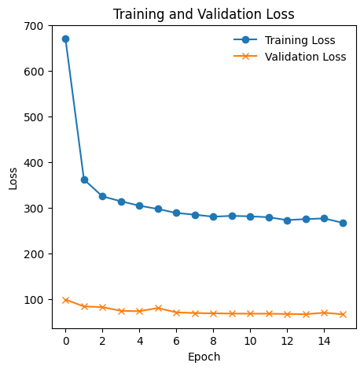
    


## Below, we ask the model to generate 20 totally random molecules, by providing it with an empty seed string.


```python
n_chars = 100

n_valid = 0
n_invalid = 0
images = []
for i in range(20):
    output = simple_rnn.simple_generate(" ", n_chars, model, chembl.char_to_idx, chembl.idx_to_char, temperature=0.5, device='cuda')
    print(f"Requested up to {n_chars} characters, got: {len(output)}")
    print(f"Molecule Canonical SMILES: {output}")

    valid = utilities.validate_smiles_string(output)

    if not valid:
        n_invalid += 1
        print("Generated SMILES is not valid.")
    else:
        n_valid += 1
        print("Generated SMILES is valid.")
        images.append(utilities.draw_molecule(output))
```

    Requested up to 100 characters, got: 101
    Molecule Canonical SMILES:  CC(=O)NCCCCCCCCCCCCCCCCCCCCCCCCCCCCCCCCCCCCCCCCCCCCCCCCCCCCCCCCCCCCCCCCCCCCCCCCCCCCCCCCCCCCCCCCCCCCC
    Generated SMILES is valid.
    Requested up to 100 characters, got: 16
    Molecule Canonical SMILES:  O(N)Cc1ccccc1Cl
    Generated SMILES is valid.


    Requested up to 100 characters, got: 101
    Molecule Canonical SMILES:  CC(C)CCCCCCCCCCCCCCCCCCCCCCCCCCCCCCCCCCCCCCCCCCCCCCCCCCCCCCCCCCCCCCCCCCCCCCCCCCCCCCCCCCCCCCCCCCCCCCC
    Generated SMILES is valid.
    Requested up to 100 characters, got: 25
    Molecule Canonical SMILES:  OC(=O)Nc1ccccc1)c1ccccc1
    Generated SMILES is not valid.
    Requested up to 100 characters, got: 30
    Molecule Canonical SMILES:  O(CCNC(=O)c1ccccc1Cl)N1CCOCC1
    Generated SMILES is valid.


    [09:32:05] SMILES Parse Error: extra close parentheses while parsing: OC(=O)Nc1ccccc1)c1ccccc1
    [09:32:05] SMILES Parse Error: check for mistakes around position 16:
    [09:32:05] OC(=O)Nc1ccccc1)c1ccccc1
    [09:32:05] ~~~~~~~~~~~~~~~^
    [09:32:05] SMILES Parse Error: Failed parsing SMILES ' OC(=O)Nc1ccccc1)c1ccccc1' for input: ' OC(=O)Nc1ccccc1)c1ccccc1'


    Requested up to 100 characters, got: 85
    Molecule Canonical SMILES:  CCCCCCCCCCCCCCCCCCCCCCCCCCCCCCCCCCCCCCCCCCO[C@@H]1O[C@H](CO)[C@@H](O)[C@H](O)[C@H]1O
    Generated SMILES is valid.
    Requested up to 100 characters, got: 31
    Molecule Canonical SMILES:  Oc1cccc(Cl)c1)c1cccc(C(=O)O)c1
    Generated SMILES is not valid.


    [09:32:05] SMILES Parse Error: extra close parentheses while parsing: Oc1cccc(Cl)c1)c1cccc(C(=O)O)c1
    [09:32:05] SMILES Parse Error: check for mistakes around position 14:
    [09:32:05] Oc1cccc(Cl)c1)c1cccc(C(=O)O)c1
    [09:32:05] ~~~~~~~~~~~~~^
    [09:32:05] SMILES Parse Error: Failed parsing SMILES ' Oc1cccc(Cl)c1)c1cccc(C(=O)O)c1' for input: ' Oc1cccc(Cl)c1)c1cccc(C(=O)O)c1'


    Requested up to 100 characters, got: 101
    Molecule Canonical SMILES:  CC(C)CCCCCCCCCCCCCCCCCCCCCCCCCCCCCCCCCCCCCCCCCCCCCCCCCCCCCCCCCCCCCCCCCCCCCCCCCCCCCCCCCCCCCCCCCCCCCCC
    Generated SMILES is valid.
    Requested up to 100 characters, got: 101
    Molecule Canonical SMILES:  CC(C)CC(=O)NCCCCCCCCCCCCCCCCCCCCCCCCCCCCCCCCCCCCCCCCCCCCCCCCCCCCCCCCCCCCCCCCCCCCCCCCCCCCCCCCCCCCCCCC
    Generated SMILES is valid.
    Requested up to 100 characters, got: 42
    Molecule Canonical SMILES:  COc1ccc(NC(=O)CCN2CCN(c3ccccc3)CC2)c(C)c1
    Generated SMILES is valid.
    Requested up to 100 characters, got: 46
    Molecule Canonical SMILES:  O=C(NCc1ccccc1)C(=O)N1CCC(C(=O)NCc2ccccc2)CC1
    Generated SMILES is valid.
    Requested up to 100 characters, got: 101
    Molecule Canonical SMILES:  O(C(=O)O)C(=O)COC(=O)CNC(=O)[C@H](CCCCNC(=O)[C@H](CCCNC(=N)N)NC(=O)[C@H](CCCNC(=N)N)NC(=O)[C@H](CCCN
    Generated SMILES is not valid.
    Requested up to 100 characters, got: 42
    Molecule Canonical SMILES:  CC(C)CCN(CCCCN)C(=O)CCc1ccc(-c2ccccc2)cc1
    Generated SMILES is valid.

    [OUTPUT CURTAILED]


## Visualising the attemps at generating molecules

For such a simple model, the results of this test are rather impressive. The model has learned to generate valid SMILES strings, which correspond to real molecules. In order to do this, the model will have implicitly "learned" the correct valences for atoms, common functional groups, and the rules of SMILES syntax, which is not a trivial task.

We can see that the model has learned to generate a variety of different molecules, some of which are quite complex. The model is able to generate molecules with rings, branches, and various functional groups, all while adhering to the rules of SMILES syntax. Occasionally included are rarer functional groups which are common in some pharmaceuticals, such as trifluoromethyl groups (CF3).

Of course, because SMILES strings are syntactially rigid, often with long-range dependencies, a simple model like this smaller LSTM will sometimes generate molecules which are _almost_ but not quite valid. Models become better at avoiding these syntactic errors with longer training and larger models. 

Above, we can see that the model has learned to generate valid SMILES strings, but we can also see information on the types of errors the model makes. These fall into two categories, syntactic errors, where the model generates a string which is not valid SMILES, and semantic errors, where the model generates a valid SMILES string but one which does not correspond to a real molecule. 

Syntactic: e.g. The model has a tendancy to open parentheses but not close them, or opening rings but not specifying where they close.
`SMILES Parse Error: extra open parentheses while parsing: CC(=O)N[C@@H](CCCCN)C(=O)N[C@@H](CCCCN)C(=O)N[C@@H](CCCN=C(N)N)C(=O)N[C@@H](CC(C)C)C(=O)N[C@@H](CCCC
SMILES Parse Error: check for mistakes around position 96:
(CC(C)C)C(=O)N[C@@H](CCCC
`

Semantic: E.g. Occasionally generating molecules where atoms have incorrect valences (e.g. F with two bonds):
`SMILES Parse Error: Failed parsing SMILES ' HC(=O)N[C@H](C(=O)N[C@@H](CCCCN)C(=O)N[C@@H](CCCCN)C(=O)N[C@@H](CCCCN)C(=O)N[C@@H](Cc1ccc(O)cc1)C(=O''
Explicit valence for atom # 0 F, 2, is greater than permitted` 

The model also appears to have a real desire to generate long, saturated hydrocarbon chains. The training data does include some of these, so it's not surprising that the model has learned to generate them. If in doubt, the next character is probably just a saturated carbon atom.


```python
display(Markdown(f"# Generated {n_valid} valid and {n_invalid} invalid SMILES strings out of 5 attempts."))
display(Markdown("## Generated Molecules"))
for img in images:
    display(img)
```


# Generated 14 valid and 6 invalid SMILES strings out of 5 attempts.


## Generated Molecules


    
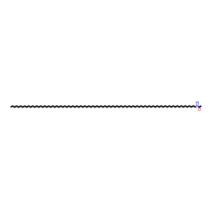
    


    
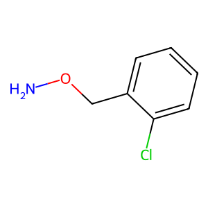
    


    
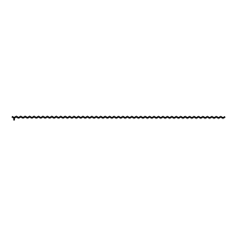
    


    
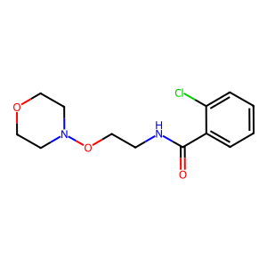
    


    
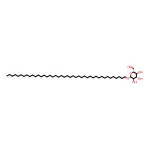
    


    

    


    
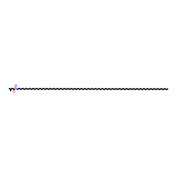
    


    
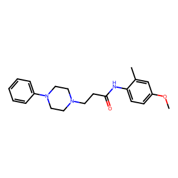
    


    
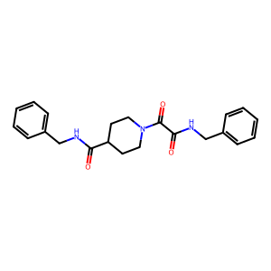
    


    
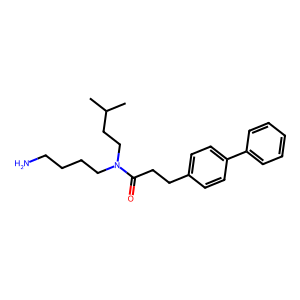
    


    
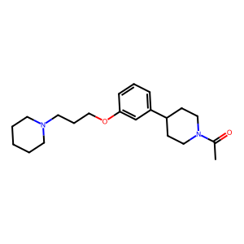
    


    
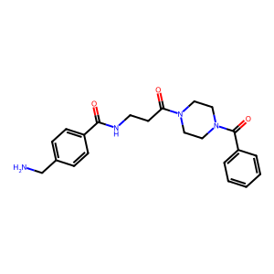
    


    
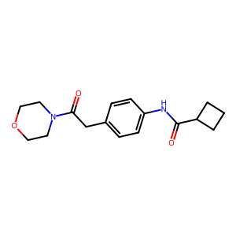
    


    
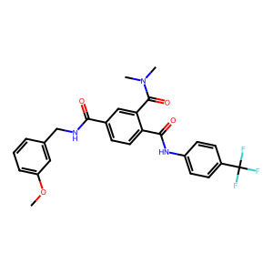
    


## Generating random molecules is fun, but a real example of where this sort of model might be useful would be the generation of molecules with specific properties...

In other models, we'll work to condition the initial state of the model with a vector of desired properties extracted from CHEMBL, but for now, we could say that we hope to generate _variants_ of an existing molecule, but with random, physically plausible changes to the structure.

Lets take caffiene, every scientists favourit, without it no work would get done. It is described by the following SMILES string `CN1C=NC2=C1C(=O)N(C(=O)N2C)C`.

We can generate a series of caffiene-like molecules by providing the model with a portion of the caffiene SMILES and asking it to predict the next character in the SMILES string.


```python
n_chars = 100

n_valid = 0
n_invalid = 0
images = []
for i in range(20):
    output = simple_rnn.simple_generate("CN1C=NC2=C1C(=O)N", n_chars, model, chembl.char_to_idx, chembl.idx_to_char, temperature=0.8, device='cuda')
    print(f"Requested up to {n_chars} characters, got: {len(output)}")
    print(f"Molecule Canonical SMILES: {output}")

    valid = utilities.validate_smiles_string(output)

    if not valid:
        n_invalid += 1
        print("Generated SMILES is not valid.")
    else:
        n_valid += 1
        print("Generated SMILES is valid.")
        images.append(utilities.draw_molecule(output))
```

    Requested up to 100 characters, got: 30
    Molecule Canonical SMILES: CN1C=NC2=C1C(=O)N(CCN)C2=CC2=O
    Generated SMILES is not valid.


    [09:35:59] SMILES Parse Error: unclosed ring for input: 'CN1C=NC2=C1C(=O)N(CCN)C2=CC2=O'


    Requested up to 100 characters, got: 96
    Molecule Canonical SMILES: CN1C=NC2=C1C(=O)N(CC(=O)N[C@H](CC(=O)Nc3ccc(OCc4ccccc4)cc3)c3ccccc3)C(=O)N1C=C2C(=O)c2ccccc2C1=O
    Generated SMILES is valid.
    Requested up to 100 characters, got: 19
    Molecule Canonical SMILES: CN1C=NC2=C1C(=O)N13
    Generated SMILES is not valid.
    Requested up to 100 characters, got: 42
    Molecule Canonical SMILES: CN1C=NC2=C1C(=O)N(CCCc3ccccc3)c3ccccc3C2=O
    Generated SMILES is valid.
    Requested up to 100 characters, got: 32
    Molecule Canonical SMILES: CN1C=NC2=C1C(=O)N1CCCC1)C1CCCCC1
    Generated SMILES is not valid.


    [09:35:59] SMILES Parse Error: unclosed ring for input: 'CN1C=NC2=C1C(=O)N13'
    [09:35:59] SMILES Parse Error: extra close parentheses while parsing: CN1C=NC2=C1C(=O)N1CCCC1)C1CCCCC1
    [09:35:59] SMILES Parse Error: check for mistakes around position 24:
    [09:35:59] C=NC2=C1C(=O)N1CCCC1)C1CCCCC1
    [09:35:59] ~~~~~~~~~~~~~~~~~~~~^
    [09:35:59] SMILES Parse Error: Failed parsing SMILES 'CN1C=NC2=C1C(=O)N1CCCC1)C1CCCCC1' for input: 'CN1C=NC2=C1C(=O)N1CCCC1)C1CCCCC1'


    Requested up to 100 characters, got: 42
    Molecule Canonical SMILES: CN1C=NC2=C1C(=O)N(CC(=O)Nc3ccc(Cl)nc3)C2=O
    Generated SMILES is valid.
    Requested up to 100 characters, got: 37
    Molecule Canonical SMILES: CN1C=NC2=C1C(=O)NC1(c1ccccc1)c1ccccc1
    Generated SMILES is not valid.
    Requested up to 100 characters, got: 33
    Molecule Canonical SMILES: CN1C=NC2=C1C(=O)NC(C(N)=O)C(=O)O2
    Generated SMILES is valid.
    Requested up to 100 characters, got: 39
    Molecule Canonical SMILES: CN1C=NC2=C1C(=O)NC(=O)[C@]2(O)C[C@@H]2O
    Generated SMILES is not valid.


    [09:35:59] SMILES Parse Error: ring closure 1 duplicates bond between atom 9 and atom 10 for input: 'CN1C=NC2=C1C(=O)NC1(c1ccccc1)c1ccccc1'
    [09:35:59] SMILES Parse Error: unclosed ring for input: 'CN1C=NC2=C1C(=O)NC(=O)[C@]2(O)C[C@@H]2O'


    Requested up to 100 characters, got: 36
    Molecule Canonical SMILES: CN1C=NC2=C1C(=O)N(c3ccccc3)C(=O)CC2C
    Generated SMILES is valid.
    Requested up to 100 characters, got: 83
    Molecule Canonical SMILES: CN1C=NC2=C1C(=O)NC(NC(=O)c3ccccc3)c2ccc(OCc3ccccc3)cc21)C(=O)N2CCC(Oc2ccc(F)cc2)CC1
    Generated SMILES is not valid.
    Requested up to 100 characters, got: 29
    Molecule Canonical SMILES: CN1C=NC2=C1C(=O)N[C@@H](CO)C2
    Generated SMILES is valid.


    [OUTPUT CURTAILED]


```python
display(Markdown(f"# Generated {n_valid} valid caffiene-like molecules and {n_invalid} invalid SMILES strings out of 5 attempts."))
display(Markdown("## Generated Molecules"))
for img in images:
    display(img)
```


# Generated 7 valid caffeine-like molecules and 13 invalid SMILES strings out of 5 attempts.


## Generated Molecules


    
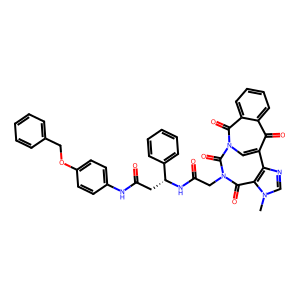
    


    
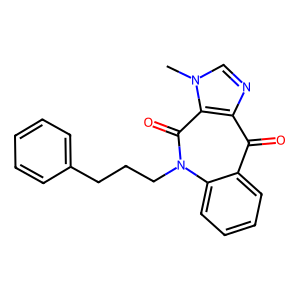
    


    
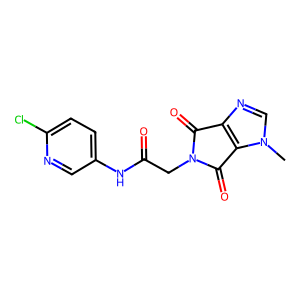
    


    
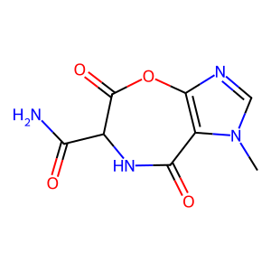
    


    
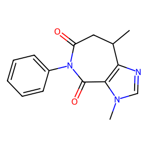
    


    
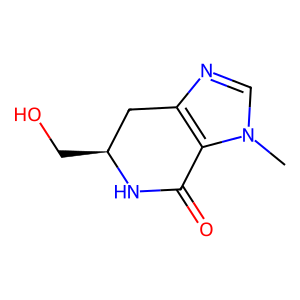
    


    
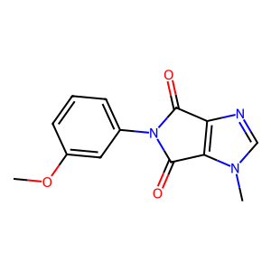
    

